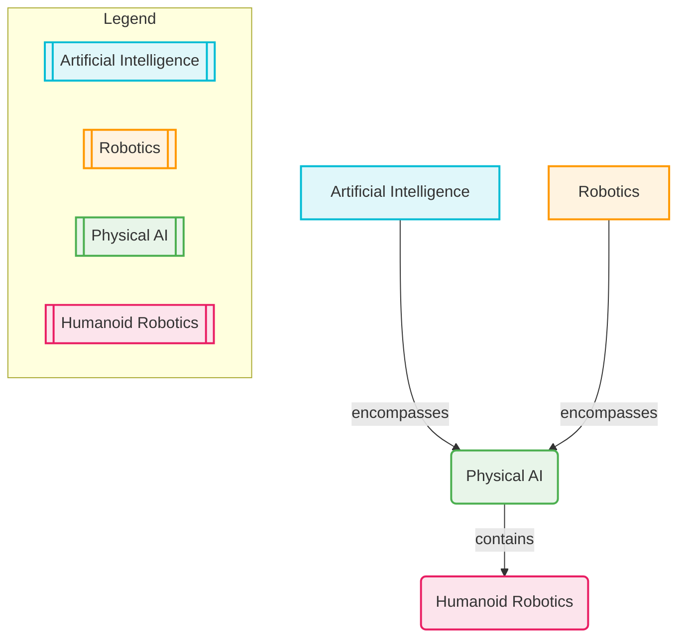

# Introduction to Physical AI and Robotics

## 1.1 What is Physical AI?

Physical AI refers to artificial intelligence systems that are embodied in the physical world, interacting with their environment through sensors and actuators. Unlike purely software-based AI, which operates in virtual environments, Physical AI directly experiences and influences the real world. This embodiment is crucial for tasks requiring motor control, perception, and interaction with dynamic, unpredictable surroundings.

**Key Characteristics:**
- **Embodiment**: AI is integrated into a physical body (e.g., a robot).
- **Perception**: Uses sensors (cameras, LiDAR, touch sensors) to gather real-world data.
- **Action**: Affects the environment through actuators (motors, grippers).
- **Real-time Interaction**: Operates continuously within physical constraints and dynamics.

Think of it as the difference between a chess AI (purely computational) and a robotic arm playing chess (Physical AI). The robotic arm not only needs to strategize but also perceive the board, grasp pieces, and execute movements with precision in a physical space.

:::info Advanced Insight: Morphological Computation
In advanced Physical AI, the physical body's design (morphology) can significantly simplify control and computation. This concept, known as **morphological computation**, suggests that some aspects of intelligent behavior can emerge from the physical properties and interactions of the robot's body with its environment, rather than solely from complex AI algorithms.
:::

## 1.2 Defining Humanoid Robotics

Humanoid robotics is a specialized field within robotics focused on designing and building robots that resemble the human body in form and/or function. These robots are engineered to operate in human-centric environments, often performing tasks that would typically require human-like dexterity, locomotion, and interaction capabilities.

**Key Characteristics:**
- **Anthropomorphic Design**: Possess a head, torso, two arms, and two legs (though variations exist).
- **Bipedal Locomotion**: Ability to walk on two legs, mimicking human gait.
- **Dexterous Manipulation**: Hands designed for complex grasping and manipulation tasks.
- **Human-Environment Compatibility**: Designed to navigate and interact with spaces built for humans (e.g., stairs, doorways, tools).

Examples range from research platforms like Boston Dynamics' Atlas, designed for complex locomotion and manipulation, to interactive companions like Honda's ASIMO, developed for human assistance and interaction. The challenges in humanoid robotics are immense, encompassing balance, compliant actuation, advanced perception, and sophisticated AI for decision-making and learning.

## 1.3 A Brief History of AI and Robotics

The journey of AI and robotics is a fascinating tapestry woven over centuries, moving from ancient automata to sophisticated modern systems.

**Early Concepts & Automata (Ancient to 19th Century):**
- **Ancient Greece**: Myths and legends featured intelligent automatons (e.g., Talos, Hephaestus's creations).
- **Medieval Islamic World**: Engineers like Al-Jazari designed intricate programmable automata, including a robot band and a hand-washing automaton.
- **Renaissance Europe**: Leonardo da Vinci sketched designs for a humanoid robot, and Jacques de Vaucanson created the "Digesting Duck."
- **18th-19th Century**: Rise of mechanical toys and intricate clockwork figures, laying conceptual groundwork for complex machinery.

**Birth of Modern AI (Mid-20th Century):**
- **1940s-1950s**: Emergence of cybernetics (Norbert Wiener) and the concept of intelligent machines. Alan Turing's work on computability and the Turing Test (1950) provided a philosophical and practical foundation for AI.
- **1956 Dartmouth Workshop**: Coined the term "Artificial Intelligence," marking the official birth of AI as a field. Early AI focused on problem-solving, symbolic reasoning, and expert systems.

**Early Robotics (Mid-20th Century):**
- **1950s**: George Devol patented the first programmable robot, "Unimate." Joseph Engelberger partnered with Devol to create Unimation, the first robotics company.
- **1960s**: Industrial robots became prevalent in manufacturing, particularly in automotive factories, performing repetitive tasks like welding and assembly.
- **Shakey the Robot (SRI International, 1960s-70s)**: The first mobile robot to reason about its own actions. Shakey integrated perception, world modeling, and planning, a precursor to modern intelligent agents.

**AI Winter & Revival (1980s-1990s):**
- Periods of reduced funding and interest in AI ("AI Winters") occurred as initial hype outpaced capabilities.
- Revival was fueled by increased computational power, new algorithms (e.g., backpropagation for neural networks), and access to larger datasets.
- Robotics saw advances in control systems and new applications beyond manufacturing (e.g., remote-controlled vehicles).

**21st Century — The Golden Age (2000s-Present):**
- **Machine Learning & Deep Learning**: Breakthroughs in deep neural networks, particularly in image recognition (ImageNet), speech processing, and natural language understanding, have dramatically advanced AI capabilities.
- **Humanoid Robotics Proliferation**: Significant strides in bipedal locomotion, dynamic balance, and manipulation with robots like Honda's ASIMO, Boston Dynamics' Atlas, and numerous research platforms.
- **Physical AI Convergence**: Stronger integration of advanced AI algorithms with sophisticated robotic hardware, enabling robots to perform complex tasks in unstructured environments.
- **Ethical Considerations**: Growing awareness and discussion around the ethical implications of advanced AI and robotics, including job displacement, bias, safety, and human-robot interaction norms.

This brief history illustrates a continuous drive to build machines that not only compute but also perceive, reason, and act intelligently in the physical world, leading us to the sophisticated Physical AI and humanoid robotics we see today.

## 1.4 Why Study Physical AI and Humanoid Robotics?

The study of Physical AI and humanoid robotics is more relevant today than ever before, driven by technological advancements, societal needs, and the pursuit of understanding intelligence itself.

**1. Addressing Grand Challenges:**
- **Healthcare**: Assistive robotics for the elderly and disabled, surgical robots, prosthetic limbs with advanced control.
- **Disaster Response**: Robots for search and rescue in hazardous environments, inspection of damaged infrastructure.
- **Exploration**: Robots for space exploration (e.g., Mars rovers), deep-sea exploration where human presence is difficult or dangerous.

**2. Economic and Industrial Impact:**
- **Automation**: Revolutionizing manufacturing, logistics, and service industries, increasing efficiency and safety.
- **New Industries**: Creation of entirely new sectors focused on robotic development, AI integration, and human-robot collaboration.
- **Job Transformation**: While some jobs may be automated, new roles in robot maintenance, programming, and supervision emerge.

**3. Scientific and Philosophical Advancement:**
- **Understanding Intelligence**: Building intelligent physical systems helps us better understand the nature of intelligence, cognition, and consciousness.
- **Biomechanics & Neuroscience**: Robotics research often provides insights into human and animal movement, control, and brain function.
- **Future of Humanity**: Explores the possibilities and challenges of a future where humans and intelligent robots coexist and collaborate.

**4. Personal and Societal Enhancement:**
- **Quality of Life**: Robots can perform mundane, dangerous, or physically demanding tasks, freeing humans for more creative and fulfilling endeavors.
- **Education**: Robotic kits and platforms serve as powerful educational tools, engaging students in STEM fields.
- **Entertainment & Companionship**: Advancements in social robotics offer new forms of interaction and support.

By engaging with Physical AI and humanoid robotics, we are not just designing machines; we are shaping the future of technology, society, and our understanding of what it means to be intelligent and embodied in the world.

## 1.5 Ethical Considerations in Robotics (Initial Glimpse)

As Physical AI and humanoid robotics advance, so too do the ethical questions and societal implications they raise. It is crucial to consider these aspects from the outset of our study.

**Key Ethical Domains:**
- **Safety**: Ensuring robots operate without causing harm to humans or property. This involves robust design, testing, and fail-safe mechanisms.
- **Privacy**: Robots, especially those with advanced sensors (cameras, microphones), collect vast amounts of data. Protecting privacy is paramount, particularly in domestic or public spaces.
- **Bias & Fairness**: AI algorithms can inherit and amplify biases present in their training data. Ensuring fairness in robotic decision-making (e.g., in autonomous vehicles or assistive robots) is critical.
- **Accountability**: Who is responsible when a robot makes a mistake or causes harm? Defining clear lines of accountability for autonomous systems is a complex legal and ethical challenge.
- **Job Displacement**: The automation potential of robotics can lead to significant shifts in the workforce. Ethical discussions often revolve around managing this transition and ensuring equitable access to new opportunities.
- **Human-Robot Interaction (HRI) Norms**: Establishing appropriate social and psychological boundaries for interaction, especially with increasingly human-like robots, to prevent exploitation or dependency.
- **Autonomous Weapons Systems**: The ethical debate surrounding "killer robots" and the delegation of lethal decision-making to machines. This is a highly contentious area in international ethics and law.

These considerations are not abstract philosophical exercises but practical challenges that engineers, policymakers, and society must address collaboratively to ensure that Physical AI and humanoid robotics are developed and deployed responsibly for the benefit of all.

## Exercises

### Exercise 1.1: Historical Breakthrough in Robotics

Research and write a short essay (200-300 words) on a historical breakthrough in robotics. Focus on its significance, the technologies involved, and its impact on the field. Examples include the development of Unimate, Shakey the Robot, or Honda's ASIMO.

### Exercise 1.2: Humanoid Robot Applications

Brainstorm and list three distinct real-world applications where humanoid robots could provide significant value. For each application, justify why a humanoid form factor is beneficial or necessary compared to other types of robots.

## Review Questions

1.  What is the primary difference between purely software-based AI and Physical AI?
2.  List three key characteristics of humanoid robotics.
3.  Briefly describe one significant historical milestone in the development of AI or Robotics.
4.  Why is the study of Physical AI and Humanoid Robotics considered important for addressing grand challenges?
5.  Name two ethical considerations that arise with the advancement of Physical AI and humanoid robotics.

## Review Questions

1.  What is the primary difference between purely software-based AI and Physical AI?
2.  List three key characteristics of humanoid robotics.
3.  Briefly describe one significant historical milestone in the development of AI or Robotics.
4.  Why is the study of Physical AI and Humanoid Robotics considered important for addressing grand challenges?
5.  Name two ethical considerations that arise with the advancement of Physical AI and humanoid robotics.

### Diagram 1.1: The Intersections of AI, Robotics, and Physical AI

_Description: This Venn Diagram visually represents the relationship between Artificial Intelligence, Robotics, Physical AI, and Humanoid Robotics. Artificial Intelligence and Robotics are two distinct but overlapping fields. The intersection where AI is embodied in physical systems is defined as Physical AI. Humanoid Robotics is a specialized subset within Physical AI, focusing on robots that resemble and interact with the human form._

